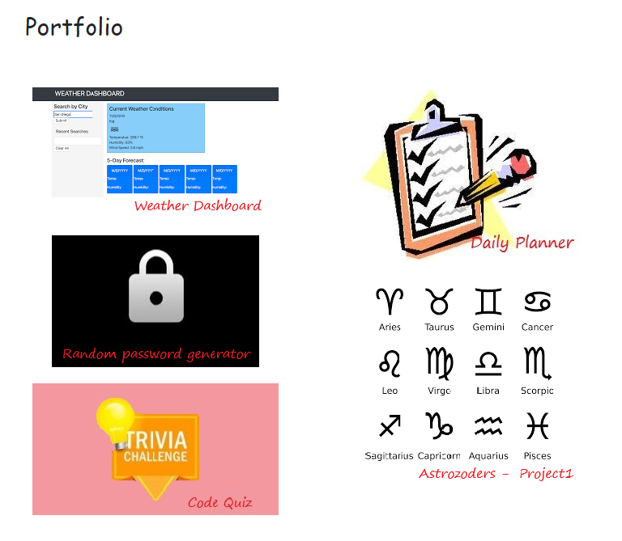
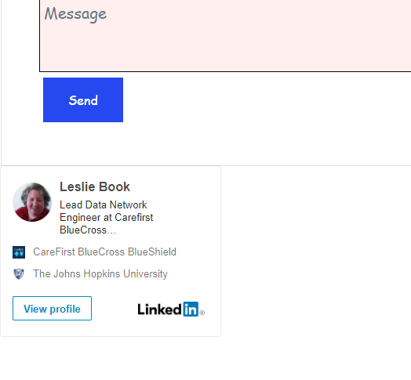

The purpose of this exercise was to update our existing Portfolio to reflect some of the completed work in this course. I made very few changes to the original portfolio html, css and bootstrap. I was able to create a better portfolio.html representation. Each assignment/project is represented by a clickable link to the published application.

This updated portfolio is published: https://leskbook.github.io/homework2Portfolio/

I have also included a link to my LinkedIN profile on the Contact page.

